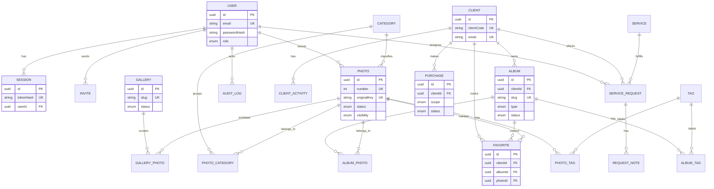

# Nostos API — Functional Requirements & Traceability

Source: project-owner functional briefing (authoritative product input).
Complementary on-disk input: `future updates/ideas.txt` (dashboard states,
notifications, Payment ≠ Purchase, global search, settings tabs).
Conceptual input: the existing model at the actual path
`docs/database/initial-model.md` — note it is referenced as
`docs/database/initial-model.mmd` in `AGENTS.md` and prior messages, but the
file on disk is `.md`; it is left untouched and the mismatch is reported
rather than silently renamed.
Superseded: any older Iron-session reference — the approved API-owned opaque
session architecture (`DECISIONS.md`) wins for auth/session implementation.

Status legend used throughout:

* **Confirmed** — explicitly established by the project owner.
* **Proposed** — architecture recommendation, needs approval.
* **Decision Required** — genuinely needs the owner's choice.
* **Deferred** — intentionally Phase 2 or later (see `ROADMAP.md`).

---

## 1. Requirement audit (one row per mandated item)

| # | Requirement | Model audit | Phase | Status |
|---|---|---|---|---|
| 1 | Public Gallery (public archive, only approved/published) | Challenged A-vs-B — **Model B curated collection**, see §2b | 1 | Proposed |
| 2 | Configurable Categories | Was hard-coded list in frontend — **new `Category` entity** | 1 | Confirmed |
| 3 | Gallery filtering/sorting (category, tag, date, newest/oldest, combined) | Missing — query contract on public listing | 1 | Confirmed |
| 4 | Gallery search (photo, ID, category, tag) | Missing — search contract (trigram) | 1 | Confirmed |
| 5 | Photo detail + copyright/credit | Missing — detail DTO + global copyright text | 1 | Confirmed |
| 6 | Public photo publishing (exists → approved → published → visible) | `visibility` alone insufficient — **`status` workflow added** | 1 | Confirmed |
| 7 | Tags (photos + albums, CRUD, PUBLIC/INTERNAL) | Was strings/`ClientTag` — **normalized `Tag` + joins** | 1 | Confirmed |
| 8 | Clients (1 account, 1 unique email, phone optional, code, owns albums) | Correct, extended with `clientCode` + album ownership | 1 | Confirmed |
| 9 | Purchase history (history, amount, timestamp, status, items, client link) | Missing — **minimal `Purchase`**, provider deferred | 1 minimal / 2 full | Confirmed + Proposed split |
| 10 | Client timeline | Correct (`ClientActivity`) | 1 | Confirmed |
| 11 | Album types WATERMARK/PAID/FREE with behaviors | Was ambiguous portfolio/delivery — **redefined client-owned + `albumType`** | 1 | Confirmed |
| 12 | Favorites (client-scoped, count, survives rules, purchase basis) | Missing — **new `Favorite`** | 1 | Confirmed (+2 Proposed sub-rules) |
| 13 | Photo access states (6 listed) | Must NOT be one enum — **derived, see §5** | 1 | Confirmed |
| 14 | Claim (reference upload → visual similarity → watermarked view → purchase) | Missing — **fully deferred**, no SQL pretence | 2 | Deferred + Decision Required |
| 15 | Service Request onboarding (common + 4 service shapes + contact) | Flat fields insufficient — **relational core + `answers` JSONB** | 1 | Confirmed (+Proposed shape) |
| 16 | Public website tabs | Consumer (site nav), no model impact | — | Confirmed |
| 17 | Internal staff roles (5, no CLIENT role) | Correct — matrix updated, client never authenticates | 1 | Confirmed |
| 18 | Analytics (visitors, views, events, hashed, rotating salt) | Missing — **recommend defer**, minimal schema documented | 2 (Proposed) | Deferred |
| 19 | Visitor tracking + events + periods | Same as 18 | 2 (Proposed) | Deferred |
| 20 | 2FA for admin accounts | Missing — TOTP fields reserved, scope undecided | Later | **Decision Required** |
| 21 | Audit logs (actor, action, resource, result, metadata, immutable) | Missing — **new `AuditLog`**, append-only | 1 | Confirmed |
| 22 | Secure file URLs (private storage, signed/presigned) | Correct direction, hardened per album entitlement | 1 | Confirmed |
| 23 | Upload security (MIME + magic-byte, names, 50 MB) | Correct, unchanged | 1 | Confirmed |
| 24 | Service/product purchase (single, pack, full album) | Via minimal `Purchase` (no provider) | 1 minimal / 2 full | Confirmed + Proposed split |
| 25 | Photo packs | `Purchase.packPhotoIds` snapshot | 1 | Proposed |
| 26 | Backend authorization + IDOR | Correct, unchanged | 1 | Confirmed |
| 27 | Argon2id / opaque sessions / CSRF / CORS / rate-limit / login protection | Correct, unchanged; gallery-code attempts add a limiter | 1 | Confirmed |
| 28 | Secret management / never trust client input | Correct, unchanged | 1 | Confirmed |
| 29 | `Purchase ≠ provider transaction ≠ invoice` | Explicit three-layer split documented | 1 / 2 / 2 | Confirmed |
| 30 | No `CLIENT` staff role; actors are visitor / client-record / staff | Correct, enforced | 1 | Confirmed |
| 31 | Global dashboard search (Client/Email/Album/Photo/Request/Purchase/Tags IDs) | Missing API support — search endpoints per domain | 1 (basic) / 2 (global) | Proposed split |
| 32 | Notifications (request/album/purchase/staff events, email first) | Missing — event list documented, delivery Phase 2 | 2 | Deferred |

---

## 2. Gallery vs Album (reconciled — replaces previous semantics)

```text
Public Gallery  →  Nostos public portfolio (curated collection, Model B)
Client → Album (WATERMARK | PAID | FREE)  →  client delivery
```

Terminology (binding): **Gallery** is the public Nostos photo archive.
**Album** is private client delivery. **"Portfolio" is a product/marketing
term for the public-gallery experience — it is not an entity and no
`Portfolio` table will be created** unless a real requirement demands it.

* **Gallery is a curated public collection (Model B — challenged and
  re-decided, see §2b).** It owns membership, ordering, and featured flags;
  the archive listing/search/filter layer queries through it. There is no
  client gallery and no gallery access code — delivery is `Album` only.

### §2b. Gallery Model A vs Model B (challenged conclusion)

Model A (rejected): public gallery = bare query over published photos, order
via `Photo.featuredPosition`. Sufficient for a single flat listing, but it
cannot represent membership curation (which photos are exhibited vs merely
published), per-collection ordering, featured pins, multiple future
collections, or collection-level publish/unpublish — all required or
foreseen (§9: ordering, featured, publish/unpublish, "future multiple public
collections", editorial control). Bolting these on later means inventing the
join table anyway, plus a data migration.

Model B (recommended): `Gallery{id, slug UNIQUE (public, guessable OK),
title, description?, status DRAFT|PUBLISHED, position? (collection order),
createdAt, updatedAt}` +
`GalleryPhoto{galleryId FK CASCADE, photoId FK CASCADE, position int,
isFeatured bool default false, addedAt}`, PK `(galleryId, photoId)`,
`UNIQUE(galleryId, position)`. Reasons: (1) ordering/featured are
per-collection editorial facts, not photo attributes; (2) membership is
explicit — publishing a photo does not force exhibition; (3) N future
collections with zero schema change; (4) collection publish/unpublish without
touching photos; (5) listing still filters `Photo.status=PUBLISHED AND
visibility=PUBLIC` at read time, so photo gates remain the safety net.
Seeded default collection: `archive`. Copyright stays global (no duplication).
**Proposed**, needs approval — but it is a recommendation with concrete
reasons, not a guess: do not preserve Gallery merely from history, and do not
drop it merely because a query suffices today.
* **Album** belongs to exactly one Client (`clientId NOT NULL`, `RESTRICT` on
  client delete). It is the only client-delivery container — albums are never
  public portfolios; public collections are `Gallery` rows.

### Album ownership & access

| Aspect | Rule | Status |
|---|---|---|
| Ownership | `Album.clientId` exactly one client; client has many | Confirmed |
| Access link | unguessable `slug` + access code (Argon2id hash) | Confirmed |
| WATERMARK/PAID published | access code **mandatory** | Proposed |
| FREE published | access code optional | Proposed |
| Slug alone | grants nothing; unknown slug → 404 | Confirmed |
| Expiry | `expiresAt?`; expired link denies new reads | Confirmed |
| Favorites | WATERMARK + FREE (visible photos); PAID visible subset only | Confirmed-derived |
| Staff visibility | role-gated reads (photographer/assistant delivery roles) | Confirmed |
| Download/purchase rights | derived from type + entitlement, never stored flags | Confirmed |
| Album deletion with history | blocked while COMPLETED purchases reference it — archive (`status→ARCHIVED`) instead; `Purchase.albumId` is `RESTRICT` | Proposed |

### §2c. Album access = stateless capability (no `AlbumSession` table)

Because clients never authenticate, private access is a capability, never an
identity: the Client record is not a credential and knowing a Client ID
grants nothing. Access link: `/a/:slug?a=<token>&exp=<ts>`, where `token =
HMAC-SHA256(serverSecret, albumId | secretVersion | exp)`, verified
statelessly; `Album.secretVersion` rotation revokes all outstanding links at
once. The optional access code is presented per request and Argon2id-verified;
attempts are strictly rate-limited per album + IP. Favorites, purchase, and
download endpoints all require (capability + code-if-set + unexpired album).
No `AlbumAccess`/`AlbumAccessToken`/`AlbumSession` rows in Phase 1 — nothing
to store, nothing to leak; persistent device sessions (if ever needed) are a
Phase 2 consideration. Validated: revoke (rotation), expiry (`exp` +
`expiresAt`), rotation, favorites (independent rows), purchase link
(`albumId`), downloads (per-request check) all hold. One honest limitation:
stateless access yields no per-visit identity log — mitigated by failed-code
audit events plus cheap `Album.views`/`lastViewedAt` counters; identity-level
visit history waits for Phase 2 analytics. **Proposed**, needs approval.

### §2d. Album code: recommended B for paid, A for FREE (Option C rejected)

A (capability URL only): frictionless, but a leaked link is full access —
acceptable only for FREE. B (URL + separate code): knowledge factor on top of
possession; right for WATERMARK/PAID published albums. C (slug + code only):
weakest — the slug is the identifier, so the code becomes the sole secret and
is enumerable. Recommendation: **B for WATERMARK/PAID, A for FREE**.
**Proposed**, needs approval.

---

## 3. Album types (explicit `albumType`, no contradictory booleans)

`Album.type: WATERMARK | PAID | FREE`. Behavior ownership:

* **Album**: type, `priceCents?` (PAID full price), `packPriceCents?` +
  `packSize?` (WATERMARK pack offer), `currency`, `status`
  DRAFT|PUBLISHED|ARCHIVED, `expiresAt?`, `allowDownload` **derived**.
* **AlbumPhoto**: `position`, `isPreview` (PAID: which subset is visible;
  forced true for all rows when type is WATERMARK/FREE), `addedAt`.
* **Purchase** (minimal, §7): scope PHOTO|PACK|ALBUM with price snapshot.
* **Entitlement (derived, §6b)**: which photos are final/downloadable —
  no table in Phase 1 (case analysis below proves sufficiency).

WATERMARK: all visible, all watermarked, favorites on, single/pack/full
purchase → purchased photos final. PAID: only `isPreview` subset visible
(watermarked), rest locked, full-album purchase only → whole album final.
FREE: all visible, no watermark, favorites + downloads on, no payment.

Persisted `AlbumPhoto` fields are exactly `position`, `isPreview`, `addedAt`
— editorial/configuration state. Ownership/access state lives in
`Purchase`/entitlement (§6); everything else (`Visible/Watermarked/Locked/
Hidden/Purchased/Downloadable`) is the runtime derived response. No giant
state enum exists anywhere.

---

## 4. Photo access states (derived, not one enum)

Persistent: `Photo.status` (DRAFT|APPROVED|PUBLISHED) + `Photo.visibility`
(PUBLIC|UNLISTED|PRIVATE) + `Album.type` + `AlbumPhoto.isPreview`.
Entitlement: derived from completed `Purchase` rows.
Presentation: `Visible / Watermarked / Locked / Hidden` computed per
(photo, album-context, client); `Purchased / Downloadable` computed from
entitlement. Nothing purchase-derived is stored on `Photo`.

## 5. Favorites

`Favorite{id, clientId FK CASCADE, albumId FK CASCADE, photoId FK CASCADE,
createdAt}`, `UNIQUE(clientId, albumId, photoId)`. A favorite may only be
created for a photo visible to that client in that album (validated at
write). Favorites persist after expiry but read-access follows album access
(`maintain while access remains valid` = access-checked reads, not deletion).
Staff with delivery roles may view per-album favorite lists/counts (purchase
assistance). **Proposed** sub-rules needing approval: keep-on-expiry (vs
purge) and staff visibility scope as stated.

## 6. Purchases (minimal Phase 1 vs full Phase 2)

```text
Purchase ≠ Payment ≠ Entitlement
```

* **Purchase (Phase 1)** is the commercial record: who bought which scope at
  which price and when. `{id, clientId FK RESTRICT, scope PHOTO|PACK|ALBUM,
  photoId?, albumId?, packPhotoIds JSONB snapshot, priceCents, currency,
  status PENDING|COMPLETED|FAILED|REFUNDED, note?, completedAt?, createdAt}`.
  Statuses are staff-confirmed (e.g. transfer received); **no provider**.
* **Payment (Phase 2)** is the provider transaction: provider, providerRef,
  amount, status, webhook refs, `purchaseId?`. It confirms a Purchase but is
  a separate record — a Purchase can exist while payment is pending/failed
  (per `ideas.txt`: "Payment ≠ Purchase").
* **Entitlement (derived, no Phase 1 table)** is what unlocks a photo: the
  read-time function `canAccess(client, photo, context)` over COMPLETED
  purchases. Direct photo purchase unlocks that photo; a pack unlocks the
  snapshot list; a full-album purchase unlocks current album membership at
  read time (**Proposed**: later-added photos included — simplest consistent
  rule for "bought the album"). FAILED/CANCELLED/REFUNDED rows are excluded,
  so revocation is automatic with no flag updates. Purchased photos live
  nowhere as stored state — they are the completed-Purchase join. Phase 2 may
  materialize entitlements for performance (deferred consideration, not need).
* Aggregates on the client page (latest purchase, total spent, photos/albums
  purchased) are derived queries, never stored counters.

### §6b. Entitlement case analysis (validates the no-table model)

| Case | Derived result | Safe? |
|---|---|---|
| Buy photo A | COMPLETED `Purchase(PHOTO, photoId=A)` → A final/downloadable | Yes |
| Buy pack A+B+C | snapshot list → each member final | Yes |
| Buy full album | current membership at read time → all final (**Proposed**: later-added photos included) | Yes |
| Failed payment | status ≠ COMPLETED → excluded | Yes |
| Cancelled/refunded | status change → access lost automatically; already-downloaded files cannot be retrieved (stated limit, not a flaw) | Yes |
| Photo removed from album | album-scope cover ends; direct/pack purchases of it remain valid | Yes |
| Photo "deleted" | hard delete forbidden while purchases/favorites reference it (RESTRICT + guard); withdrawal = unpublish, row retained, purchase record immutable; files retained while any COMPLETED purchase references the photo | Yes |

Verdict: the derived model represents every case without an entitlement
table. The only accepted cost is read-time joins (materialize in Phase 2 if
measured slow — deferred, not needed now).

### §6b. Entitlement case analysis (validates the no-table model)

| Case | Derived result | Safe? |
|---|---|---|
| Buy photo A | COMPLETED `Purchase(PHOTO, photoId=A)` → A final/downloadable | Yes |
| Buy pack A+B+C | snapshot list → each member final | Yes |
| Buy full album | current membership at read time → all final (**Proposed**: later-added photos included) | Yes |
| Failed payment | status ≠ COMPLETED → excluded | Yes |
| Cancelled/refunded | status change → access lost automatically; already-downloaded files cannot be retrieved (stated limit, not a flaw) | Yes |
| Photo removed from album | album-scope cover ends; direct/pack purchases of it remain valid | Yes |
| Photo "deleted" | hard delete forbidden while purchases/favorites reference it (RESTRICT + guard); withdrawal = unpublish, row retained, purchase record immutable; files retained while any COMPLETED purchase references the photo | Yes |

Verdict: the derived model represents every case without an entitlement
table. The only accepted cost is read-time joins (materialize in Phase 2 if
measured slow — deferred, not needed now).

## 7. Tags & Categories

`Tag{id, name, slug UNIQUE, description?, status ACTIVE|INACTIVE,
visibility PUBLIC|INTERNAL}` + `PhotoTag` / `AlbumTag` joins (`CASCADE` both
sides: deleting a tag removes associations only, never photos/albums).
Inactive tags stay on existing rows but are rejected for new public filtering;
INTERNAL tags never leave staff endpoints. `ClientTag` is **dropped** — no
demonstrated normalized requirement (frontend client tags stay free-form
`string[]` on the record). **Proposed**, needs approval.
`Category{id, name, slug UNIQUE, description?, status, position UNIQUE}`
is a separate first-class entity: a stable curated taxonomy driving public
filters and ordering, while tags are free-form labels. Because a photo may
belong to several categories, the relation is M:N via `PhotoCategory{photoId,
categoryId, addedAt}` — a single `categoryId` column is rejected as
incorrect for the stated requirement. No category enum exists anywhere.
**Proposed**, needs approval.

## 8. Publishing & copyright

`Photo.status: DRAFT → APPROVED → PUBLISHED` (forward-only except explicit
unpublish to DRAFT; every transition audit-logged). Public listing requires
`status=PUBLISHED AND visibility=PUBLIC` — two independent gates so neither
approval nor a visibility flag alone can publish accidentally. Unpublish is an
explicit operation (`status→DRAFT` or `visibility→PRIVATE`), also logged.
Copyright text lives once in global site configuration; per-photo credit is
the linked photographer name — no duplicated strings. Publication ordering
and featured pins live on `GalleryPhoto.position` / `isFeatured` (Model B),
never on `Photo`. **Proposed**, needs approval.

## 9. Client (confirmed)

`Client{..., clientCode UNIQUE (e.g. CLI-2026-001, auto-generated),
email NOT NULL UNIQUE normalized, phone?, ...}` — lookup by code, email,
name (powers global dashboard search). Page aggregates derived. Client never
authenticates: actors are public visitor / client record / staff user; no
`CLIENT` role.

## 10. Onboarding answers (relational core + JSONB)

Relational (filterable): `serviceId, preferredDate?, location?,
locationUndecided bool, budgetMinCents?, budgetMaxCents?, details?`,
contact as `contact JSONB` (name, email, phone, instagram, preferredContact),
service-specific answers as `answers JSONB` validated per service by a
server-side schema registry, `referenceKeys text[]` (storage keys of uploaded
references). Rationale: common fields need querying/sorting; per-service
shapes vary and must not become dozens of nullable columns. **Proposed.**

## 11. Claim (fully deferred — no fake SQL similarity)

Phase 1 builds nothing Claim-specific: no tables, no endpoints, no boundary
scaffolding. SQL text search cannot perform visual similarity and no
pretence architecture is created for it. Phase 2: reference uploads (reusing
upload-intent infrastructure), `ClaimSearch{id, referenceKey, status,
createdAt}`, embeddings pipeline, vector search with similarity ranking, and
watermarked match views. **Decision Required:** pgvector in Postgres vs
external embeddings service.

## 12. Analytics (recommended deferral)

Proposed Phase 2. Minimum safe schema if approved: `AnalyticsEvent{id,
visitorHash, sessionHash?, page, photoId?, albumId?, event, createdAt}`
(date-partitioned) + `VisitorSalt{current, previous, rotatedAt}`; visitor =
HMAC(raw IP + UA, salt), raw IP never stored. Salt honesty, stated plainly: a
**daily** rotating salt makes accurate 30/90-day unique-visitor counts
impossible (hashes unlink across days) — daily rotation yields accurate
intraday uniques plus cross-day totals/visits only. Recommended compromise:
epoch-rotating salt (e.g. 30 days) for `visitorHash` (uniques accurate within
the epoch) plus a daily salt for session linkage, 13-month rolling retention.
Metrics (uniques, visits, views, top pages/photos, funnel, 24h–1y) derived in
batch, never per-request. GDPR compliance is a legal decision, not claimed
here. No Analytics tables in Phase 1.

## 13. 2FA & AuditLog

2FA: **Decision Required** — optional per-user vs mandatory ADMIN. Reserved
(no choice made): `totpSecret` (encrypted), `backupCodesHash[]`, enforcement
point at login before session creation; session system unchanged.
`AuditLog{id, actorId FK SET NULL, action, resourceType, resourceId,
result, metadata JSONB (no secrets), createdAt}` — append-only (no update/
delete grants or endpoints); Phase 1 events: auth (login/logout/failures),
user/invite/role changes, publish/unpublish, gallery/album share/rotate,
purchase status changes, upload finalize, access-code changes.

## 14. Corrected domain model (Phase 1 entities)

User, Session, Invite, Client (`clientCode`, `status ACTIVE|ARCHIVED`,
`deletedAt?`; never hard-deleted while albums/purchases/activity exist —
see §14b), ClientActivity, Service, ServiceRequest (searchable core columns
`stage, serviceId, clientId, contactEmail, preferredDate, location` +
`contact`/`answers` JSONB + `referenceKeys text[]`; indexes on the core
columns), RequestNote, Category, PhotoCategory (M:N — photos may belong to
several categories, so no `categoryId`), Tag, PhotoTag, AlbumTag, Photo
(`status` + `visibility`, no stored URLs/counters), Gallery + GalleryPhoto
(`position`, `isFeatured`), Album (`clientId`, `type`, `slug`,
`accessCodeHash?`, `secretVersion`, pricing, `status`, `expiresAt?`, `views` /
`lastViewedAt?` counters), AlbumPhoto (`position`, `isPreview`, `addedAt` —
editorial/config state only), Favorite, Purchase (minimal commercial record),
AuditLog. Required indexes: all FKs; UNIQUE slugs/numbers/codes/emails/
references/token hashes; composite PKs on joins; `UNIQUE(galleryId, position)`
/ `UNIQUE(albumId, position)`; partial index on `Photo(status, visibility)`
for the public listing; trigram (GIN) on client/photo name-title search;
`(resourceType, resourceId)` on AuditLog (polymorphic, no FK).
No `Entitlement` table in Phase 1 (derived, §6b). No `AlbumSession` table
(stateless capability, §2c). Dropped vs original concept: `ClientServices`,
`ClientTag`, `s3_*` URL fields. Phase 2: Document/LineItem, Order/OrderItem,
`Payment` (provider transaction), MailThread/Message, Rendition,
`ClaimSearch`, `AnalyticsEvent`.

### §14b. Client deletion policy (historical integrity)

Hard deletion is forbidden while albums, purchases, or activity reference the
client (FKs `RESTRICT` + application guard). Deactivation = `status→ARCHIVED`
+ `deletedAt` timestamp; the email is anonymized (`deleted_<uuid>@
archived.invalid`) so the UNIQUE address can be re-registered, while all
history stays linked by id. Purchases and financial history are immutable
regardless. **Proposed**, needs approval.

## 15. Corrected ER diagram (Phase 1)



## 15b. SeaweedFS storage architecture (reviewed — topology stays open)

Genuinely undecided: single vs replicated topology and backups (owner's infra
choice). Everything else is decided architecture: collections
`nostos-originals/` (private, no anonymous access) and `nostos-derivatives/`
(private, served only via presigned/CDN-signed reads); presigned PUT for
upload (≤15 min TTL, `content-length` + `content-type` conditions) and
presigned GET for reads (short TTL); 50 MB maximum enforced before signing
and re-verified at finalize; formats JPEG/PNG/WebP plus camera RAW
extensions; server-side `file-type` magic-byte validation against an
allowlist (client MIME is a hint); client-supplied SHA-256 verified at
finalize; object naming `originals/{uuid}-{slugified}` and derivatives
`{photoId}/{variant}.{ext}`; abandoned `PENDING` intents swept after 24h.
**Proposed** except topology/backups (**Decision Required**).

## 16. Traceability (requirement → entity → API area → phase → status)

| Requirement | Entity | API area | Phase | Status |
|---|---|---|---|---|
| Public Gallery + filters/sort/search/detail | Gallery, GalleryPhoto, Photo, Category, Tag | `GET /v1/public/galleries`, `/v1/public/photos/:number` | 1 | Model B Proposed |
| Categories (configurable, CRUD, M:N) | Category, PhotoCategory | `/v1/categories` | 1 | Confirmed + Proposed join |
| Publishing workflow + copyright config | Photo.status, SiteConfig | photo publish endpoints | 1 | Confirmed + Proposed |
| Tags (+albums, visibility, CRUD) | Tag, PhotoTag, AlbumTag | `/v1/tags` | 1 | Confirmed |
| Clients + lookup + timeline + aggregates | Client, ClientActivity | `/v1/clients` | 1 | Confirmed |
| Client-owned Albums + 3 types | Album, AlbumPhoto | `/v1/albums`, `/v1/public/a/:slug` | 1 | Confirmed |
| Favorites | Favorite | `/v1/albums/:id/favorites` | 1 | Confirmed |
| Minimal Purchase/entitlement | Purchase | `/v1/purchases` (staff-confirmed) | 1 | Proposed |
| Provider payments, Documents, Orders, Email | Phase 2 entities | Phase 2 areas | 2 | Deferred |
| Onboarding (core + answers JSONB) | ServiceRequest | `/v1/requests`, public intake | 1 | Confirmed + Proposed |
| Claim (fully deferred, no P1 scaffolding) | `ClaimSearch` (Phase 2) | reserved | 2 | Deferred + Decision Required (vector backend) |
| Analytics (+privacy controls) | `AnalyticsEvent` (Phase 2, no P1 tables) | reserved | 2 (Proposed) | Deferred (approval) |
| 2FA | (reserved TOTP fields) | login enforcement | Later | Decision Required |
| AuditLog | AuditLog | append-only, all domains | 1 | Confirmed |
| Auth/sessions (opaque, Iron superseded) | Session, User | `/v1/auth` | 1 | Confirmed |
| Upload security + presigned + private storage | Photo, upload intents | `/v1/photos/uploads` | 1 | Confirmed |
| Staff roles (5, no CLIENT) + matrix | User.role | `requireRole` everywhere | 1 | Confirmed |
