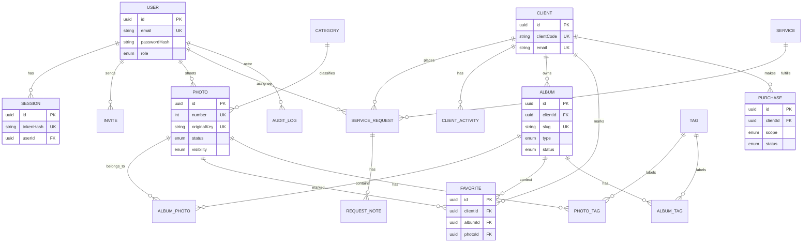

# Nostos API — Functional Requirements & Traceability

Source: project-owner functional briefing (authoritative product input).
Complementary on-disk input: `future updates/ideas.txt` (dashboard states,
notifications, Payment ≠ Purchase, global search, settings tabs).
Superseded: any older Iron-session reference — the approved API-owned opaque
session architecture (`DECISIONS.md`) wins for auth/session implementation.

Status legend used throughout:

* **Confirmed** — explicitly established by the project owner.
* **Proposed** — architecture recommendation, needs approval.
* **Decision Required** — genuinely needs the owner's choice.
* **Deferred** — intentionally Phase 2 or later (see `ROADMAP.md`).

---

## 1. Requirement audit (one row per mandated item)

| # | Requirement | Model audit | Phase | Status |
|---|---|---|---|---|
| 1 | Public Gallery (public archive, only approved/published) | Was client-delivery entity — **redefined**, see §3 | 1 | Confirmed |
| 2 | Configurable Categories | Was hard-coded list in frontend — **new `Category` entity** | 1 | Confirmed |
| 3 | Gallery filtering/sorting (category, tag, date, newest/oldest, combined) | Missing — query contract on public listing | 1 | Confirmed |
| 4 | Gallery search (photo, ID, category, tag) | Missing — search contract (trigram) | 1 | Confirmed |
| 5 | Photo detail + copyright/credit | Missing — detail DTO + global copyright text | 1 | Confirmed |
| 6 | Public photo publishing (exists → approved → published → visible) | `visibility` alone insufficient — **`status` workflow added** | 1 | Confirmed |
| 7 | Tags (photos + albums, CRUD, PUBLIC/INTERNAL) | Was strings/`ClientTag` — **normalized `Tag` + joins** | 1 | Confirmed |
| 8 | Clients (1 account, 1 unique email, phone optional, code, owns albums) | Correct, extended with `clientCode` + album ownership | 1 | Confirmed |
| 9 | Purchase history (history, amount, timestamp, status, items, client link) | Missing — **minimal `Purchase`**, provider deferred | 1 minimal / 2 full | Confirmed + Proposed split |
| 10 | Client timeline | Correct (`ClientActivity`) | 1 | Confirmed |
| 11 | Album types WATERMARK/PAID/FREE with behaviors | Was ambiguous portfolio/delivery — **redefined client-owned + `albumType`** | 1 | Confirmed |
| 12 | Favorites (client-scoped, count, survives rules, purchase basis) | Missing — **new `Favorite`** | 1 | Confirmed (+2 Proposed sub-rules) |
| 13 | Photo access states (6 listed) | Must NOT be one enum — **derived, see §5** | 1 | Confirmed |
| 14 | Claim (reference upload → visual similarity → watermarked view → purchase) | Missing — vector search is Phase 2 | Boundary 1 / engine 2 | Confirmed split |
| 15 | Service Request onboarding (common + 4 service shapes + contact) | Flat fields insufficient — **relational core + `answers` JSONB** | 1 | Confirmed (+Proposed shape) |
| 16 | Public website tabs | Consumer (site nav), no model impact | — | Confirmed |
| 17 | Internal staff roles (5, no CLIENT role) | Correct — matrix updated, client never authenticates | 1 | Confirmed |
| 18 | Analytics (visitors, views, events, hashed, rotating salt) | Missing — **recommend defer**, minimal schema documented | 2 (Proposed) | Deferred |
| 19 | Visitor tracking + events + periods | Same as 18 | 2 (Proposed) | Deferred |
| 20 | 2FA for admin accounts | Missing — TOTP fields reserved, scope undecided | Later | **Decision Required** |
| 21 | Audit logs (actor, action, resource, result, metadata, immutable) | Missing — **new `AuditLog`**, append-only | 1 | Confirmed |
| 22 | Secure file URLs (private storage, signed/presigned) | Correct direction, hardened per album entitlement | 1 | Confirmed |
| 23 | Upload security (MIME + magic-byte, names, 50 MB) | Correct, unchanged | 1 | Confirmed |
| 24 | Service/product purchase (single, pack, full album) | Via minimal `Purchase` (no provider) | 1 minimal / 2 full | Confirmed + Proposed split |
| 25 | Photo packs | `Purchase.packPhotoIds` snapshot | 1 | Proposed |
| 26 | Backend authorization + IDOR | Correct, unchanged | 1 | Confirmed |
| 27 | Argon2id / opaque sessions / CSRF / CORS / rate-limit / login protection | Correct, unchanged; gallery-code attempts add a limiter | 1 | Confirmed |
| 28 | Secret management / never trust client input | Correct, unchanged | 1 | Confirmed |
| 29 | `Purchase ≠ provider transaction ≠ invoice` | Explicit three-layer split documented | 1 / 2 / 2 | Confirmed |
| 30 | No `CLIENT` staff role; actors are visitor / client-record / staff | Correct, enforced | 1 | Confirmed |
| 31 | Global dashboard search (Client/Email/Album/Photo/Request/Purchase/Tags IDs) | Missing API support — search endpoints per domain | 1 (basic) / 2 (global) | Proposed split |
| 32 | Notifications (request/album/purchase/staff events, email first) | Missing — event list documented, delivery Phase 2 | 2 | Deferred |

---

## 2. Gallery vs Album (reconciled — replaces previous semantics)

```text
Public Gallery  →  Nostos public portfolio (derived listing, no owner)
Client → Album (WATERMARK | PAID | FREE)  →  client delivery
```

* **Gallery** is no longer a container entity. The public archive is a query
  over `Photo` (`status=PUBLISHED AND visibility=PUBLIC`) with category/tag/
  date filters, search, `newest|oldest|featured` ordering, and a detail view
  carrying the global copyright/credit text. There is no client gallery, no
  gallery access code, no `GalleryPhoto` join.
* **Album** belongs to exactly one Client (`clientId NOT NULL`, `RESTRICT` on
  client delete). It is the only client-delivery container. Public portfolio
  collections, if ever needed as entities, reuse the public Gallery concept —
  albums are never public portfolios.

### Album ownership & access

| Aspect | Rule | Status |
|---|---|---|
| Ownership | `Album.clientId` exactly one client; client has many | Confirmed |
| Access link | unguessable `slug` + access code (Argon2id hash) | Confirmed |
| WATERMARK/PAID published | access code **mandatory** | Proposed |
| FREE published | access code optional | Proposed |
| Slug alone | grants nothing; unknown slug → 404 | Confirmed |
| Expiry | `expiresAt?`; expired link denies new reads | Confirmed |
| Favorites | WATERMARK + FREE (visible photos); PAID visible subset only | Confirmed-derived |
| Staff visibility | role-gated reads (photographer/assistant delivery roles) | Confirmed |
| Download/purchase rights | derived from type + entitlement, never stored flags | Confirmed |

---

## 3. Album types (explicit `albumType`, no contradictory booleans)

`Album.type: WATERMARK | PAID | FREE`. Behavior ownership:

* **Album**: type, `priceCents?` (PAID full price), `packPriceCents?` +
  `packSize?` (WATERMARK pack offer), `currency`, `status`
  DRAFT|PUBLISHED|ARCHIVED, `expiresAt?`, `allowDownload` **derived**.
* **AlbumPhoto**: `position`, `isPreview` (PAID: which subset is visible;
  forced true for all rows when type is WATERMARK/FREE), `addedAt`.
* **Purchase** (minimal, §7): scope PHOTO|PACK|ALBUM with price snapshot.
* **Entitlement (derived, §5)**: which photos are final/downloadable.

WATERMARK: all visible, all watermarked, favorites on, single/pack/full
purchase → purchased photos final. PAID: only `isPreview` subset visible
(watermarked), rest locked, full-album purchase only → whole album final.
FREE: all visible, no watermark, favorites + downloads on, no payment.

---

## 4. Photo access states (derived, not one enum)

Persistent: `Photo.status` (DRAFT|APPROVED|PUBLISHED) + `Photo.visibility`
(PUBLIC|UNLISTED|PRIVATE) + `Album.type` + `AlbumPhoto.isPreview`.
Entitlement: derived from completed `Purchase` rows.
Presentation: `Visible / Watermarked / Locked / Hidden` computed per
(photo, album-context, client); `Purchased / Downloadable` computed from
entitlement. Nothing purchase-derived is stored on `Photo`.

## 5. Favorites

`Favorite{id, clientId FK CASCADE, albumId FK CASCADE, photoId FK CASCADE,
createdAt}`, `UNIQUE(clientId, albumId, photoId)`. A favorite may only be
created for a photo visible to that client in that album (validated at
write). Favorites persist after expiry but read-access follows album access
(`maintain while access remains valid` = access-checked reads, not deletion).
Staff with delivery roles may view per-album favorite lists/counts (purchase
assistance). **Proposed** sub-rules needing approval: keep-on-expiry (vs
purge) and staff visibility scope as stated.

## 6. Purchases (minimal Phase 1 vs full Phase 2)

```text
Purchase ≠ Payment provider transaction ≠ Invoice/financial document
```

* Phase 1 `Purchase{id, clientId, scope PHOTO|PACK|ALBUM, photoId?,
  albumId?, packPhotoIds JSONB snapshot?, priceCents, currency,
  status PENDING|COMPLETED|FAILED|REFUNDED, completedAt?, createdAt}`.
  Statuses are staff-confirmed (e.g. transfer received); **no provider**.
* Phase 2: provider transactions, webhooks, reconciliation, Documents
  (quotes/invoices/credit notes, ATCUD), Orders fulfilment, Email/Resend.
* Aggregates on the client page (latest purchase, total spent, photos/albums
  purchased) are derived queries, never stored counters.

## 7. Tags & Categories

`Tag{id, name, slug UNIQUE, description?, status ACTIVE|INACTIVE,
visibility PUBLIC|INTERNAL}` + `PhotoTag` / `AlbumTag` joins (`CASCADE` both
sides: deleting a tag removes associations only, never photos/albums).
Inactive tags stay on existing rows but are rejected for new public filtering;
INTERNAL tags never leave staff endpoints. `ClientTag` is **dropped** — no
demonstrated normalized requirement (frontend client tags stay free-form
`string[]` on the record). **Proposed**, needs approval.
`Category{id, name, slug UNIQUE, description?, status, position UNIQUE}`
is a separate first-class entity: a stable curated taxonomy driving public
filters and ordering, while tags are free-form labels. Photo holds
`categoryId FK SET NULL` (never a hard-coded enum).

## 8. Publishing & copyright

`Photo.status: DRAFT → APPROVED → PUBLISHED` (forward-only except explicit
unpublish to DRAFT; every transition audit-logged). Public listing requires
`status=PUBLISHED AND visibility=PUBLIC` — two independent gates so neither
approval nor a visibility flag alone can publish accidentally. Copyright/credit
text lives once in global site configuration (no per-photo duplication).
**Proposed**, needs approval.

## 9. Client (confirmed)

`Client{..., clientCode UNIQUE (e.g. CLI-2026-001, auto-generated),
email NOT NULL UNIQUE normalized, phone?, ...}` — lookup by code, email,
name (powers global dashboard search). Page aggregates derived. Client never
authenticates: actors are public visitor / client record / staff user; no
`CLIENT` role.

## 10. Onboarding answers (relational core + JSONB)

Relational (filterable): `serviceId, preferredDate?, location?,
locationUndecided bool, budgetMinCents?, budgetMaxCents?, details?`,
contact as `contact JSONB` (name, email, phone, instagram, preferredContact),
service-specific answers as `answers JSONB` validated per service by a
server-side schema registry, `referenceKeys text[]` (storage keys of uploaded
references). Rationale: common fields need querying/sorting; per-service
shapes vary and must not become dozens of nullable columns. **Proposed.**

## 11. Claim (boundary now, engine later)

Phase 1: no similarity engine (SQL text search cannot do visual similarity —
stated explicitly, not pretended). Reserved boundary: reference uploads reuse
the upload-intent infrastructure; `ClaimSearch{id, referenceKey,
status, createdAt}` lands in Phase 2 with the engine. **Decision Required:**
pgvector in Postgres vs external embeddings service.

## 12. Analytics (recommended deferral)

Proposed Phase 2. Minimum safe schema if approved: `AnalyticsEvent{id,
visitorHash, sessionHash?, page, photoId?, albumId?, event, createdAt}`
(date-partitioned) + `VisitorSalt{current, previous, rotatedAt}`; visitor =
HMAC(raw IP + UA, rotating salt), raw IP never stored. Metrics (unique
visitors, visits, views, top pages/photos, funnel starts/completions, periods
24h–1y) derived. GDPR compliance is a legal decision, not claimed here.

## 13. 2FA & AuditLog

2FA: **Decision Required** — optional per-user vs mandatory ADMIN. Reserved
(no choice made): `totpSecret` (encrypted), `backupCodesHash[]`, enforcement
point at login before session creation; session system unchanged.
`AuditLog{id, actorId FK SET NULL, action, resourceType, resourceId,
result, metadata JSONB (no secrets), createdAt}` — append-only (no update/
delete grants or endpoints); Phase 1 events: auth (login/logout/failures),
user/invite/role changes, publish/unpublish, gallery/album share/rotate,
purchase status changes, upload finalize, access-code changes.

## 14. Corrected domain model (Phase 1 entities)

User, Session, Invite, Client, ClientActivity, Service, ServiceRequest (+
contact/answers JSONB), RequestNote, Category, Tag, PhotoTag, AlbumTag,
Photo (`status` + `visibility` + `categoryId` + `featuredPosition?`),
Album (`clientId`, `type`, `slug`, `accessCodeHash?`, pricing, `status`,
`expiresAt?`), AlbumPhoto (`position`, `isPreview`), Favorite, Purchase
(minimal), AuditLog. Dropped vs previous package: Gallery, GalleryPhoto,
ClientTag. Phase 2: Document/LineItem, Order/OrderItem, provider
transactions, MailThread/Message, Rendition/ClaimSearch/AnalyticsEvent.

## 15. Corrected ER diagram (Phase 1)



## 16. Traceability (requirement → entity → API area → phase → status)

| Requirement | Entity | API area | Phase | Status |
|---|---|---|---|---|
| Public Gallery + filters/sort/search/detail | Photo, Category, Tag | `GET /v1/public/gallery`, `/v1/public/photos/:number` | 1 | Confirmed |
| Categories (configurable, CRUD) | Category | `/v1/categories` | 1 | Confirmed |
| Publishing workflow + copyright config | Photo.status, SiteConfig | photo publish endpoints | 1 | Confirmed + Proposed |
| Tags (+albums, visibility, CRUD) | Tag, PhotoTag, AlbumTag | `/v1/tags` | 1 | Confirmed |
| Clients + lookup + timeline + aggregates | Client, ClientActivity | `/v1/clients` | 1 | Confirmed |
| Client-owned Albums + 3 types | Album, AlbumPhoto | `/v1/albums`, `/v1/public/a/:slug` | 1 | Confirmed |
| Favorites | Favorite | `/v1/albums/:id/favorites` | 1 | Confirmed |
| Minimal Purchase/entitlement | Purchase | `/v1/purchases` (staff-confirmed) | 1 | Proposed |
| Provider payments, Documents, Orders, Email | Phase 2 entities | Phase 2 areas | 2 | Deferred |
| Onboarding (core + answers JSONB) | ServiceRequest | `/v1/requests`, public intake | 1 | Confirmed + Proposed |
| Claim boundary | (reserved `ClaimSearch`) | reserved | 2 | Deferred + Decision Required |
| Analytics (+privacy controls) | (reserved `AnalyticsEvent`) | reserved | 2 (Proposed) | Deferred |
| 2FA | (reserved TOTP fields) | login enforcement | Later | Decision Required |
| AuditLog | AuditLog | append-only, all domains | 1 | Confirmed |
| Auth/sessions (opaque, Iron superseded) | Session, User | `/v1/auth` | 1 | Confirmed |
| Upload security + presigned + private storage | Photo, upload intents | `/v1/photos/uploads` | 1 | Confirmed |
| Staff roles (5, no CLIENT) + matrix | User.role | `requireRole` everywhere | 1 | Confirmed |
