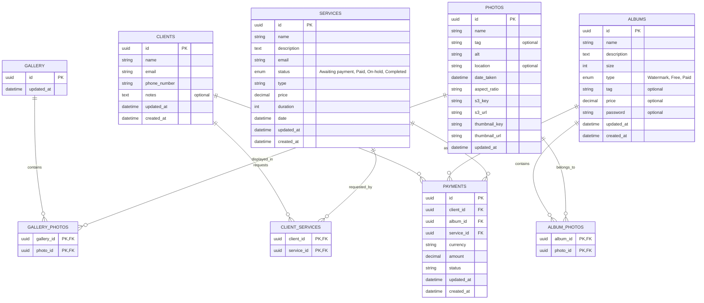

```mermaid
erDiagram

    GALLERY {
        uuid id PK
        datetime updated_at
    }

    SERVICES {
        uuid id PK
        string name
        text description
        string email
        enum status "Awaiting payment, Paid, On-hold, Completed"
        string type
        decimal price
        int duration
        datetime date
        datetime updated_at
        datetime created_at
    }

    ALBUMS {
        uuid id PK
        string name
        text description
        int size
        enum type "Watermark, Free, Paid"
        string tag "optional"
        decimal price "optional"
        string password "optional"
        datetime updated_at
        datetime created_at
    }

    CLIENTS {
        uuid id PK
        string name
        string email
        string phone_number
        text notes "optional"
        datetime updated_at
        datetime created_at
    }

    PHOTOS {
        uuid id PK
        string name
        string tag "optional"
        string alt
        string location "optional"
        datetime date_taken
        string aspect_ratio
        string s3_key
        string s3_url
        string thumbnail_key
        string thumbnail_url
        datetime updated_at
    }

    PAYMENTS {
        uuid id PK
        uuid client_id FK
        uuid album_id FK
        uuid service_id FK
        string currency
        decimal amount
        string status
        datetime updated_at
        datetime created_at
    }

    ALBUM_PHOTOS {
        uuid album_id PK, FK
        uuid photo_id PK, FK
    }

    GALLERY_PHOTOS {
        uuid gallery_id PK, FK
        uuid photo_id PK, FK
    }

    CLIENT_SERVICES {
        uuid client_id PK, FK
        uuid service_id PK, FK
    }


    ALBUMS ||--o{ ALBUM_PHOTOS : contains
    PHOTOS ||--o{ ALBUM_PHOTOS : belongs_to

    GALLERY ||--o{ GALLERY_PHOTOS : contains
    PHOTOS ||--o{ GALLERY_PHOTOS : displayed_in

    CLIENTS ||--o{ CLIENT_SERVICES : requests
    SERVICES ||--o{ CLIENT_SERVICES : requested_by

    CLIENTS ||--o{ PAYMENTS : makes
    ALBUMS ||--o{ PAYMENTS : paid_for
    SERVICES ||--o{ PAYMENTS : associated_with
```